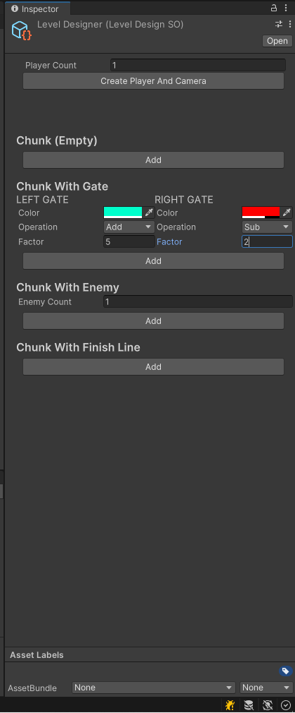

# Crowd Runner

## Description
Crowd Runner is a clone of the popular crowd-based runner game where players guide a character through an obstacle course while gathering more followers to form a larger crowd. The aim is to reach the end with as many followers as possible while avoiding obstacles, enemies, or traps that might reduce the size of your crowd.

This project has been created using Unity and is designed to replicate the mechanics and experience of similar crowd-based running games.

In this project, you can design levels from scratch using the **LevelDesigner** implemented with **ScriptableObject**. A custom UI toolkit was used for this purpose.

## Features
- Guide your character through an obstacle-filled environment.
- Collect additional characters to grow your crowd.
- Avoid traps and obstacles that reduce your crowd size.
- Reach the finish line with the largest crowd possible.

## Technologies Used
- **Engine**: Unity (for game development)
- **Language**: C# (used for scripting in Unity)

## Installation

**Build/Run the game**:
    - Click on the `Play` button in Unity Editor to test the game.
    - To create a build, go to `File > Build Settings`, select your target platform (Windows, macOS, etc.), and click `Build`

    Unity version:2022.3.37f1

**Controls**:
- Use mouse to move your character.
- Navigate through obstacles, gather followers, and aim to finish with the largest crowd possible!

## License
This project is licensed under the MIT License. See the [LICENSE](LICENSE) file for more details.

## Contributors
- **Developer**: @fatihagdagli